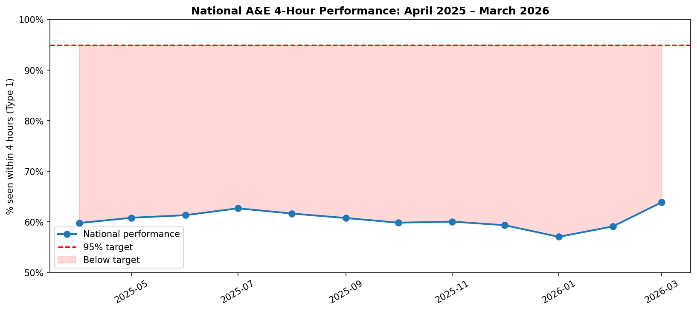
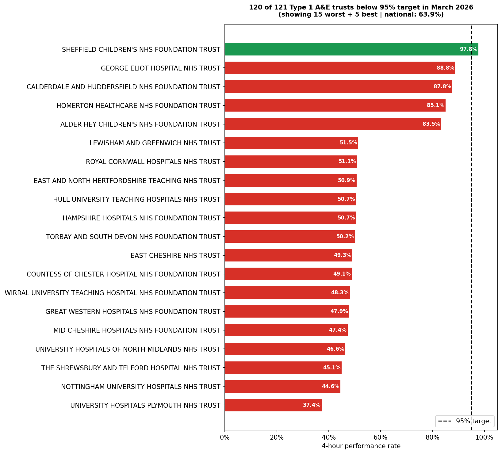
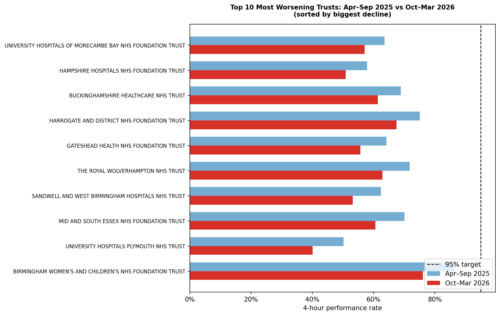

# 01 — A&E Attendances and Emergency Admissions

**Period:** April 2025 to March 2026 (12 months)  
**Scope:** 125 Type 1 (major, consultant-led) A&E departments in England  
**Target:** 95% of patients seen within 4 hours  
**Data:** NHS England — https://www.england.nhs.uk/statistics/statistical-work-areas/ae-waiting-times-and-activity/

---

## Quick results

| Metric | Value |
|---|---|
| Full-year national performance | **60.5%** |
| Gap to 95% target | **-34.5pp** |
| Total breaches (year) | **7,124,212** |
| Trusts below target (March 2026) | **120 of 121** |
| Trusts worsening H1→H2 | **45** |
| Biggest improver | Princess Alexandra Hospital (+10.6pp) |

## Charts

## Files

| File | Description |
|---|---|
| `real_nhs_ae_full_year.py` | Main analysis — loads all 12 months, runs full pipeline |
| `real_nhs_ae_march2026.py` | Single-month version (March 2026 only) |
| `FINDINGS.md` | Full written report with clinical context and recommendations |
| `output/` | Three PNG charts generated by the analysis |

## How to run

1. Download the 12 monthly CSVs from the NHS England link above
2. Update `DATA_FOLDER` at the top of `real_nhs_ae_full_year.py`
3. Run: `python real_nhs_ae_full_year.py`

→ [Full findings](./FINDINGS.md) | [Back to portfolio](../README.md)
